# Ensrick Portraits 

Provided both a zip for ease of use plus a weidu mod.

## Overwrite table

- [table](https://baldursgate.fandom.com/wiki/Portrait_File_Names)
- [replace](https://baldursgate.fandom.com/wiki/Portraits#Adding_Custom_Portraits)

## Companion Portraits

### AJANTIS

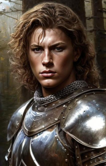

### ALORA

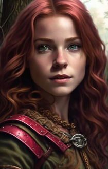

### BDIMOEN

### BDVICON

### BRANWE

### CORAN

### DORN

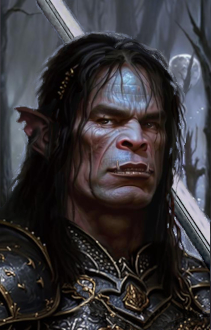

### DYNAHEI

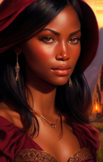

### EDWIN

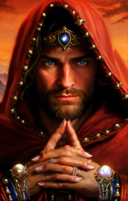

### ELDOTH

### FALDORN

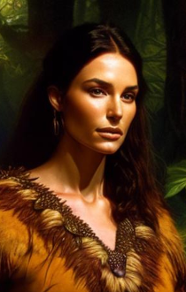

### GLINT

### IMOEN

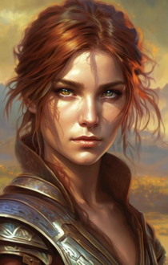

### JAHEIRA

### KHALID

### KIVAN

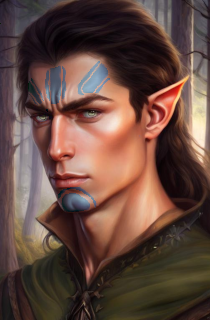

### MINSC

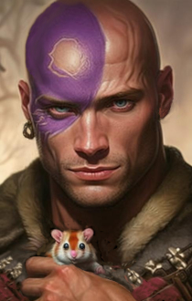

### MKHIIN

### MONTAR

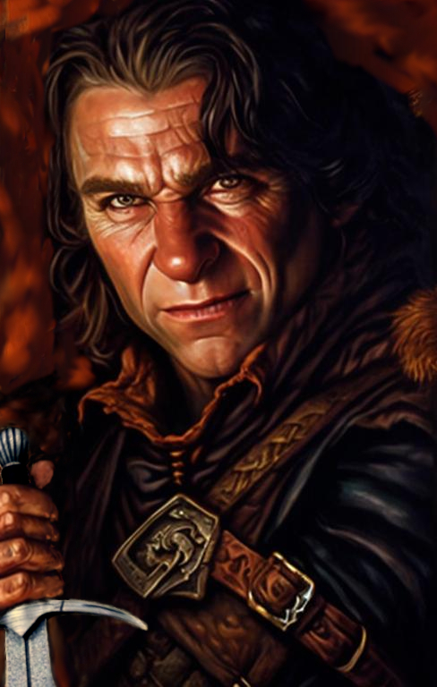

### NEDWIN

### NEERA

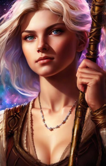

### NIMOEN

### NJAHEIR

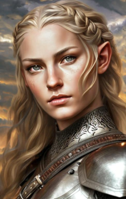

### NMINSC

### NVICON

### RASAAD

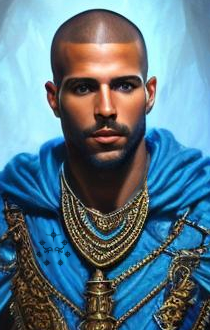

### SAFANA

### SCHAEL

### SHARTEL

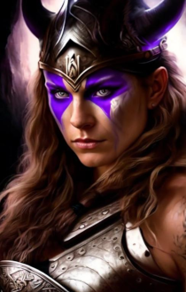

### SKIE

### VICONIA

### VOGHILN

## Protagonist Portraits

### BERSERK

