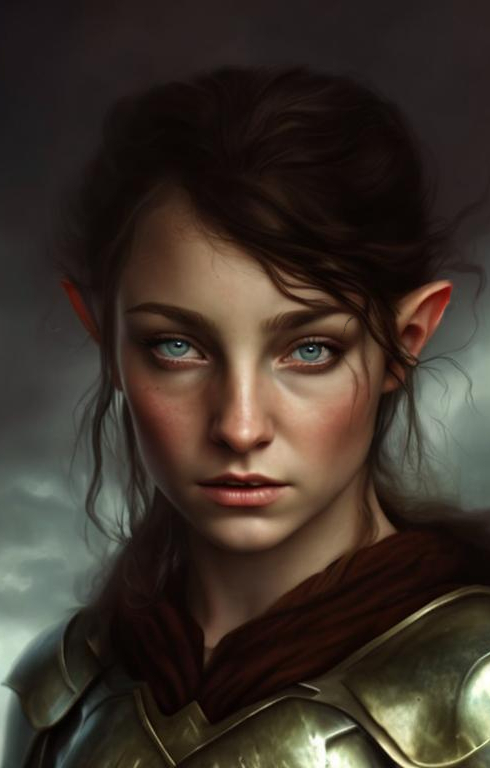
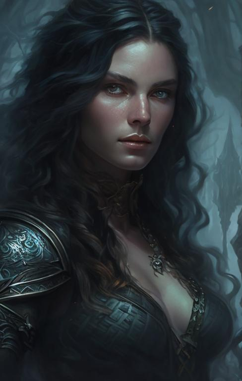
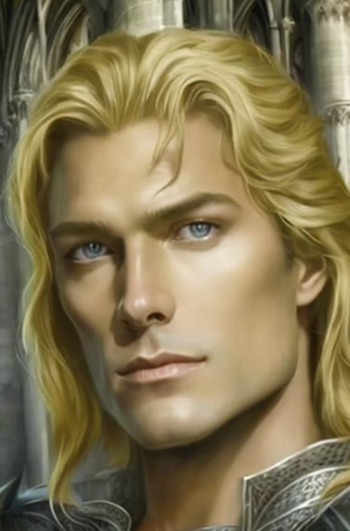

# Ensrick Portraits 

Provided both a zip for ease of use plus a weidu mod.

## Overwrite table

- [table](https://baldursgate.fandom.com/wiki/Portrait_File_Names)
- [replace](https://baldursgate.fandom.com/wiki/Portraits#Adding_Custom_Portraits)

## Companion Portraits

### AJANTIS

### ALORA

### BDIMOEN

### BDVICON

### BRANWE

### CORAN

### DYNAHEI

### EDWIN

### ELDOTH

### FALDORN

### GLINT

### IMOEN

### JAHEIRA

### KHALID

### KIVAN

### MINSC

### MKHIIN

### MONTAR

### SAFANA

### SCHAEL

### SHARTEL

### SKIE

### VICONIA

### VOGHILN

### NEDWIN

### NIMOEN

### NJAHEIR

### NMINSC

### NVICON

### DORN

### NEERA

### RASAAD

## Protagonist Portraits

### BERSERK

### FANGARM

### FEMBAR1

### FEMBARB

### FEMBLA1

### FEMCLE1

### FEMCLE2

### FEMCLE3

### FEMCLE4

### FEMDRU1

### FEMDRU2

### FEMELF1

### FEMKNI1

### FEMKNI2

### FEMLOC1

### FEMPLA1

### FEMRA1

### FEMRAN1

### FEMRAN2

### FEMROG1

### FEMSOR1

### FEMSOR2

### FEMSOR3

### FEMSOR4

### FEMSUC1

### FEMWAR1

### FEMWAR2

### FEMWAR3

### FEMWIZ1

### LICH1

### LICH2

### LICH3

### MALBAR1

### MALCLE1

### MALDRU1

### MALDWDRU

### MALKNI1

### MALLOC1

### MALPLA1

### MALPLA2

### MALRA1

### MALROG1

### MALROG2

### MALROG3

### MALROG4

### MALVAM1

### MALWAR1

### MALWAR3

### MALWAR4

### MALWAR5

### MALWAR6

### MALWIZ1

### MALWIZ2

### MALWIZ3

### MALWIZ4

### NOSFER

